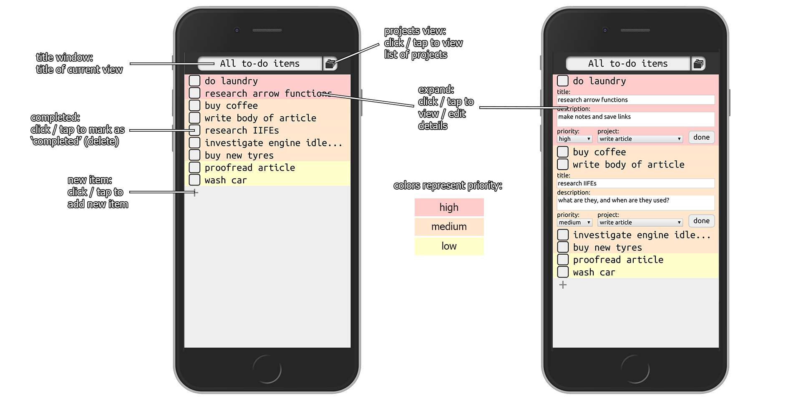
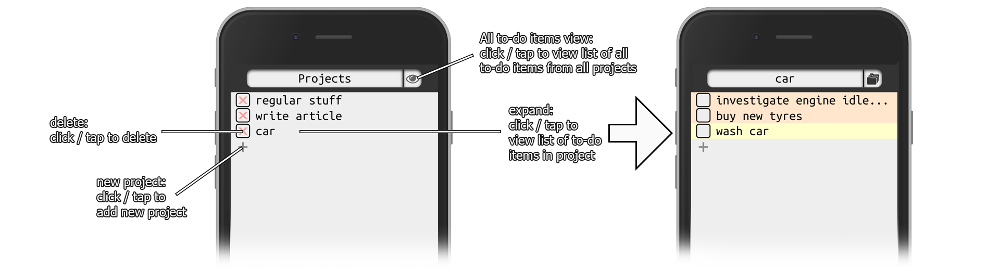
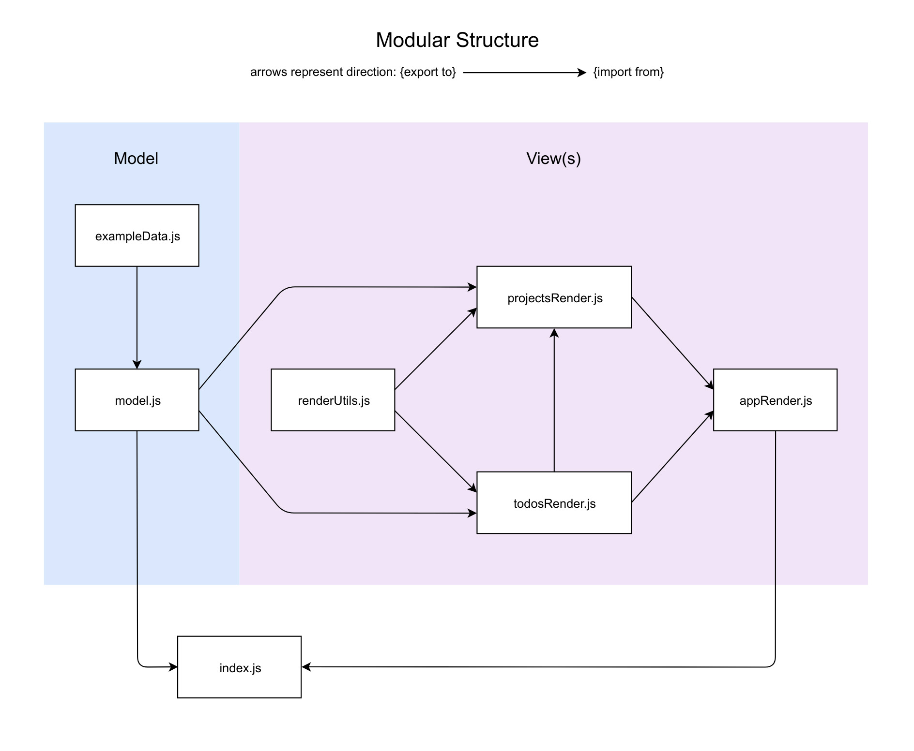

# To-do

A basic to-do list app - pure JavaScript - with separation of DOM manipulation from app logic, using modular file structure (bundled by Webpack).

Simon Tharby's solution to [Project: Todo List](https://www.theodinproject.com/courses/javascript/lessons/todo-list?ref=lnav), Organizing JavaScript Code section, Javascript unit, Odin Project.

[view in browser](https://to-do.simontharby.com/)

## Features

  * mobile-focused design, with clean and simple UI
  * to-do items color coded to show priority
  * to-do items ordered by priority, and then by order of creation
  * view to-dos by project or view all to-dos from all projects
  * click/tap a to-do item to view details/edit
  * data validation
  * separation of app logic from DOM manipulation

## Limitations

  * No permanent data storage, though modular code-base means this could easily be added. Uses browser local storage; data will reset to default example data if local storage unavailable / cleared.
  * No data security: since this is a 100% JavaScript driven app, and all code runs in the browser (and none is server-side only), there is no way to prevent malicious deletion, addition or editing of data.

## Screenshots

### All todo-items:

The default view at app start / reload. Lists all todo items from all projects, ordered by priority (and then by order of creation).

Note: multiple items can be expanded, but all expanded views will be closed if an item is saved with a changed priorty, or if a new item is added, to the currently viewed project (or the 'All to-do items view').

### Projects:

The projects view: click / tap on a project to open a list of all to-do items in that project, or click / tap the 'eye' icon on the navbar to open the 'All to-do items' view:

Note: deleting a project will also delete any to-do items it contains (user confirmation required).

## Modular structure

Separate modules, each within a separate file, were used to organize code by functionality, with particular emphasis on maximum separation of application logic from DOM manipulation. Care was taken to avoid any [circular dependency](https://stackoverflow.com/questions/46589957/es6-modules-and-circular-dependency) (a.k.a. 'cyclic dependency'):

## Getting started

To get started with the app, clone / download the repo and open 'dist/index.html' in a browser.

To include any changes made to the JavaScript files in the 'src' folder, node.js and Webpack installations are required, then Webpack can be used to bundle the changes into 'dist/main.js'.

Note: 'node_modules' folder not included in this repo (included in gitignore). The dependencies stored there can be installed from package.json by running <code>npm install</code> (if node.js is installed).
